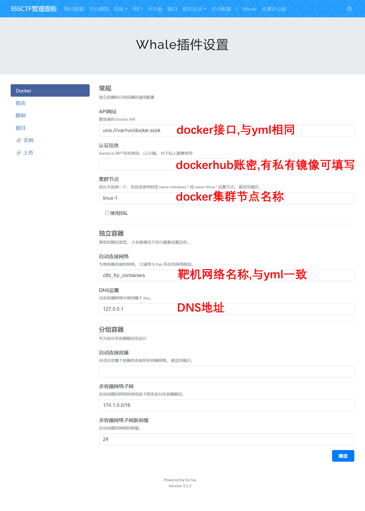
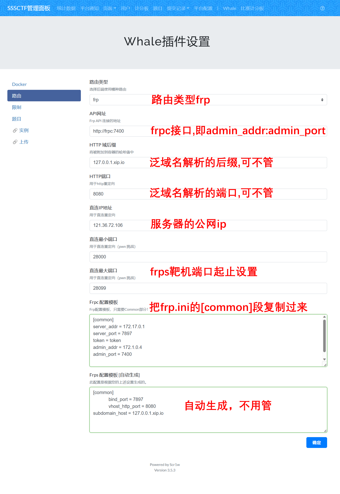
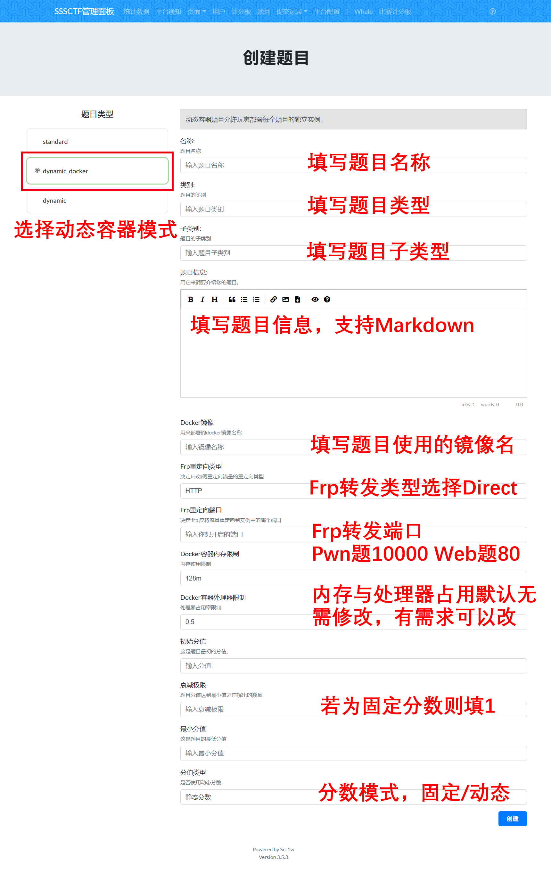
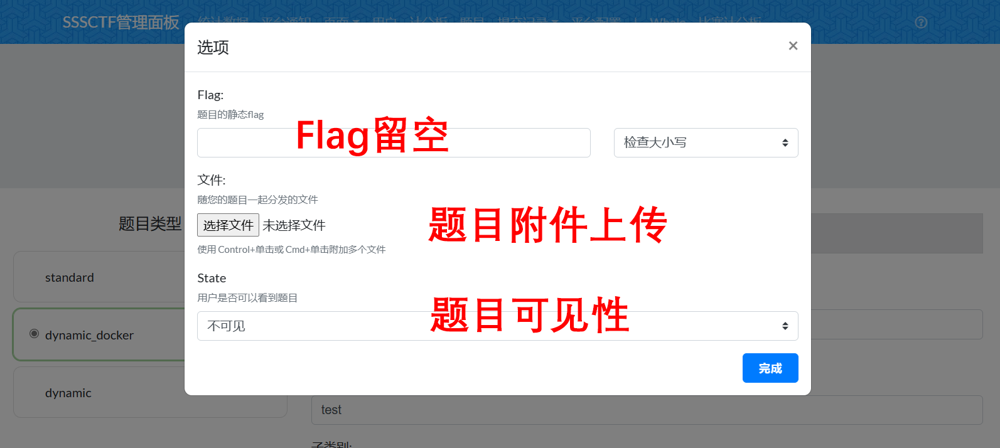
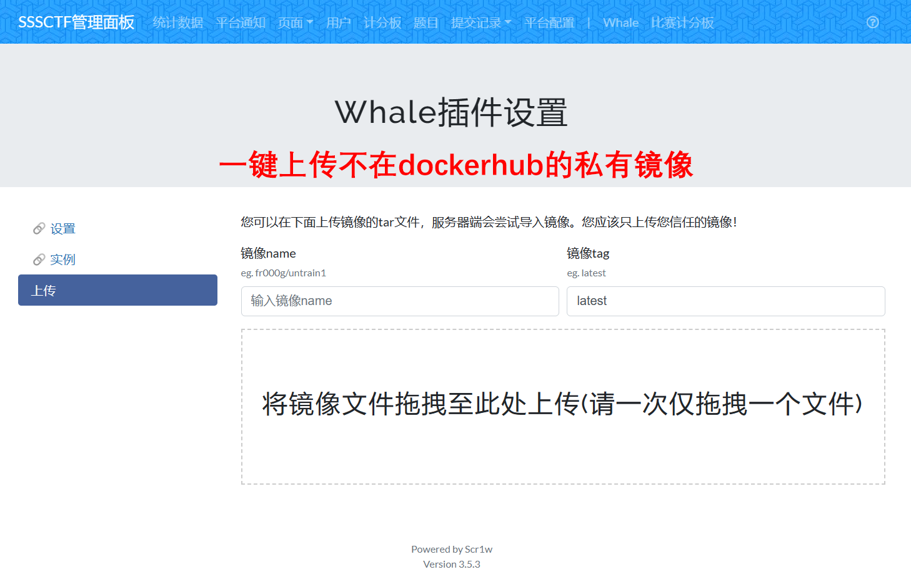

# 

## 这是个啥

基于CTFd 3.5.3 版本二次开发,整合CTFd-Whale插件,比赛计分板插件并进行修复和重构的部署版。

修复了一些原生CTFd的UI和代码问题（如提示创建和附件名称）

## [开发日志](https://github.com/dlut-sss/CTFD-Public/blob/main/CHANGELOG.md)

## 配置方法

1. ### 准备阶段

   首先，服务器中需要已经安装 docker 和 docker-compose：

   docker 安装可以参照官方文档：[Install Docker Engine on Debian | Docker Documentation](https://docs.docker.com/engine/install/debian/) 。 版本最低为:

   ```
   Docker version 20.10.18, build b40c2f6
   ```

   docker-compose 安装直接 sudo apt install docker-compose 即可。版本最低为:

   ```
   docker-compose version 1.29.2
   ```
   然后将下载完的本仓库目录重命名为CTFd

2. ### 配置frps

   ##### 下载安装frps

   ```bash
   cd
   wget https://github.com/fatedier/frp/releases/download/v0.36.2/frp_0.36.2_linux_amd64.tar.gz
   tar -zxvf frp_0.36.2_linux_amd64.tar.gz
   cd frp_0.36.2_linux_amd64
   sudo cp systemd/* /etc/systemd/system/
   sudo mkdir /etc/frp
   sudo cp frpc.ini frps.ini /etc/frp/
   sudo cp frpc frps /usr/bin/
   sudo chmod a+x /usr/bin/frpc /usr/bin/frps
   sudo systemctl enable frps
   ```

   ##### 配置frps.ini (配置时注释内容不需要直接去掉)

   ```bash
   sudo vim /etc/frp/frps.ini
   ```

   ```ini
   #frps.ini
   [common]
   bind_port = 7897
   bind_addr = 0.0.0.0
   token = token
   # vhost_http_port = 80 # 如果要配置http动态域名则需要这个。80端口开启需要systemd使用root权限启用frp，在这里不需要
   ```

   ##### 启动frps服务

   ```bash
   sudo systemctl start frps
   ```

3. ### 创建docker集群

   首先需要初始化一个 swarm 集群并给节点标注名称。

   linux 节点名称需要以 `linux-` 打头，windows节点则以 `windows-` 打头

   ```bash
   docker swarm init
   docker node update --label-add "name=linux-1" $(docker node ls -q)
   ```

   新版 ctfd-whale 利用 docker swarm 的集群管理能力，能够将题目容器分发到不同的节点上运行。选手每次请求启动题目容器时，ctfd-whale 都将随机选择一个合适的节点运行这个题目容器。

4. ### 修改内置frpc配置(默认已经改好了，如果改了token或者 改了配置需要再改，一定要去掉所有中文注释！)

   ```bash
   vim ./conf/frp/frpc.ini
   ```

   ```ini
   [common]
   token = token
   server_addr = 172.17.0.1    # 这里填写服务器ip addr之后docker0的ip地址
   server_port = 7897          # 这里需与前面frps.ini的bind_port匹配
   admin_addr = 172.1.0.4      # 这里填写frpc服务在frp网络中的ip
   admin_port = 7400
   
   # 这里需要留至少一行空行，因为新的 Whale 会把容器的转发代理写到这个文件里，没留空行的话会影响 admin_port。
   ```

5. ### docker-compose up -d

   ```bash
   chmod +x docker-entrypoint.sh
   sudo docker-compose build
   sudo docker-compose up -d
   ```

## 配置CTFD
进入 CTFd 平台之后，在 管理面板页面选择 `Whale`



## CTFd动态容器题目部署指南


点击 完成 即可发布题目。

## 给Whale增加的小功能
- 私有镜像拖拽上传

- 镜像一键更新

